开始暑期的校内实习了，我选的课题是UCloud云服务相关，记录一下实习的内容和过程

## secureCRT连接UHost云主机
1. 到UHost管理页面查看主机的外网IP
   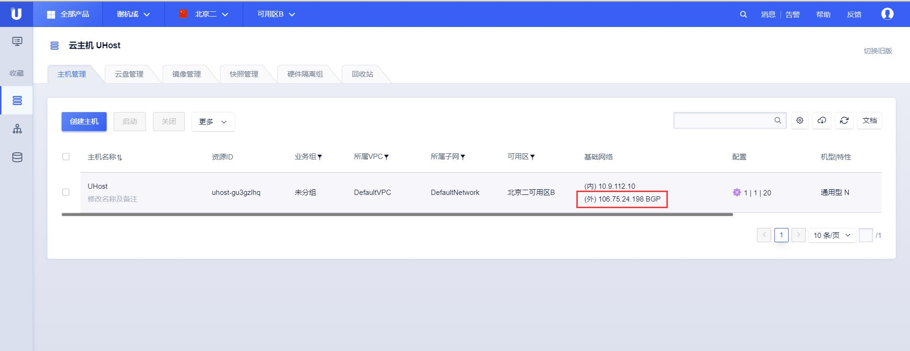
2. 打开secureCRT，创建quick connection
   
   输入hostname（外网IP），port（22），Username（一般为root）

   点击connect

   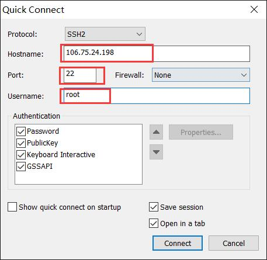
3. 弹出输入密码的对话框，输入连接主机的密码
   
4. 密码验证成功后即连接成功，可以输入一些指令测试
   
5. ping测试网络是否接入
   

## UHost主机安装相关网络服务

1. 输入以下指令安装httpd
   ``` 
   yum install httpd -y 
   ```
   
2. 输入以下指令安装php
   ``` 
   yum install php -y 
   ```
   
3. 输入以下指令安装mysql-server
   ``` 
   yum install mysql-server -y 
   ```
   
4. 输入以下指令安装php-mysql
   ``` 
   yum install php-mysql -y 
   ```
   
5. 输入以下指令启动服务
   ``` 
   service httpd start
   service mysqld start
   ```
   
6. 启动服务后，通过访问主机外网IP地址可以看到默认页面
   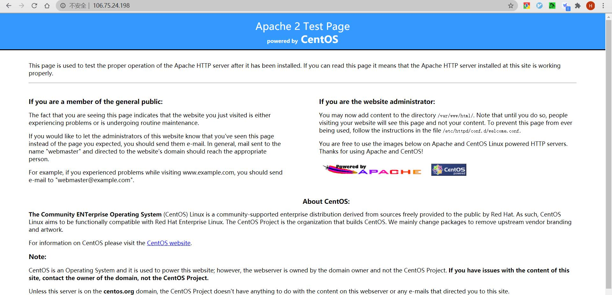

## 安装WordPress服务
1. 输入以下命令切换至web服务目录
   ```
   cd /var/www/html
   ```
   然后输入以下命令获取WordPress压缩包
   ```
   wget http://ucy.cn-bj.ufileos.com/wordpress-5.1.3-zh_CN.zip
   ```
   
2. 将下载的压缩包解压

   首先我们需要安装一个解压缩工具unzip，输入以下命令安装
   ```
   yum install unzip -y
   ```
   
   安装完成后，输入以下命令解压
   ```
   unzip wordpress-5.1.3-zh_CN.zip
   ```
   
3. 解压完成后，在浏览器中输入地址 “外网IP/wordpress/”,可访问安装页面
   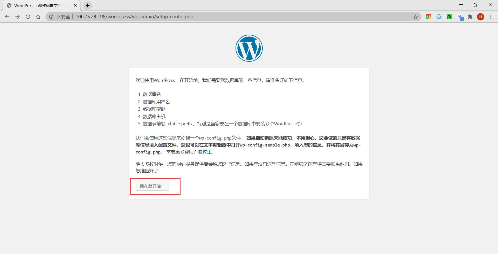
   我们发现，要安装wordpress，提示需要准备好一些信息，如数据库信息，因此我们需要先在mysql中创建一个相应的数据库
4. 输入以下命令登录mysql
   ```
   mysql -u root -p
   ```
   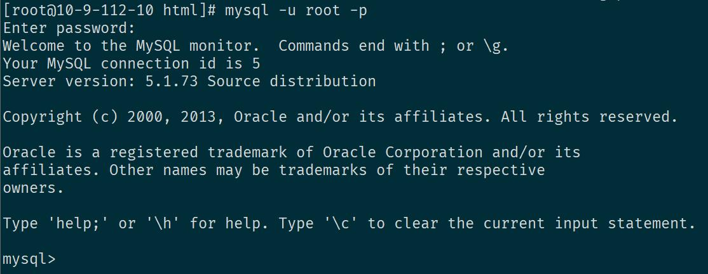
5. 在MySQL控制台中输入以下命令，创建wordpress数据库,然后退出
   ```
   CREATE DATABASE wordpress;
   exit
   ```
   
   然后回到浏览器中的wordpress安装页面，点击 现在就开始
6. 输入所需要的信息，然后点击 提交
   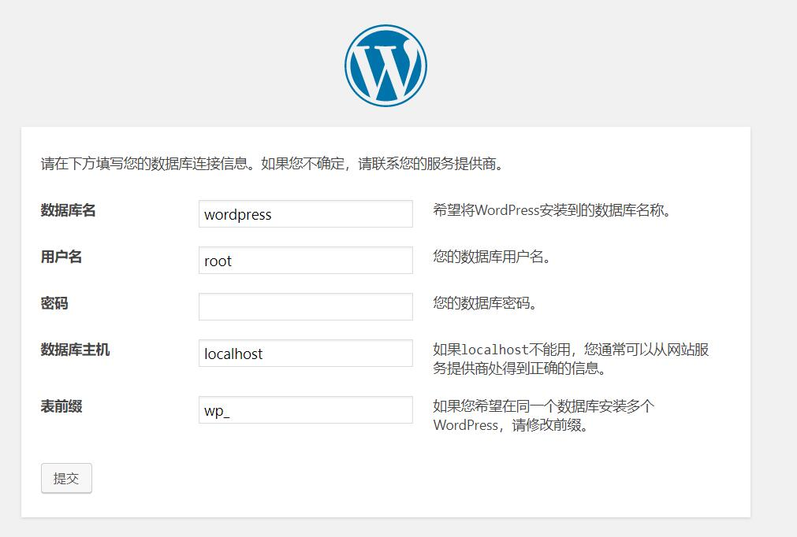
7. 之后会跳转到如下页面，告诉我们无法写入该配置文件，需要我们手动写入
   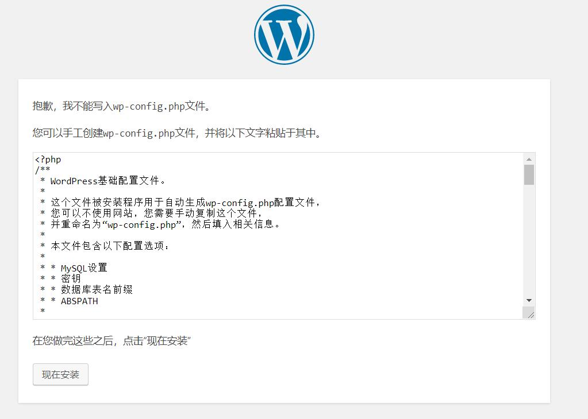
8. 输入以下命令切换至wordpress工作目录
   ```
   cd /var/www/html/wordpress/
   ```
   输入以下命令获取配置文件wp-config.php
   ```
   wget http://ucy.cn-bj.ufileos.com/wp-config.php
   ```
9. 回到浏览器，点击 现在安装，然后即可进入正式的安装程序，填写相关信息，之后点击 安装WordPress
   

## 使用WordPress发布第一篇文章
1. WordPress安装完成后，可登录此平台
   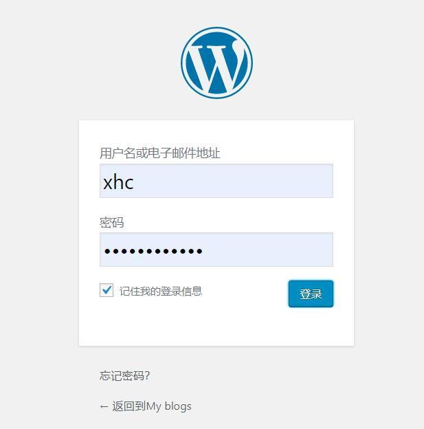
2. 登陆成功后，点击侧边菜单栏中的文章，然后点击写文章
   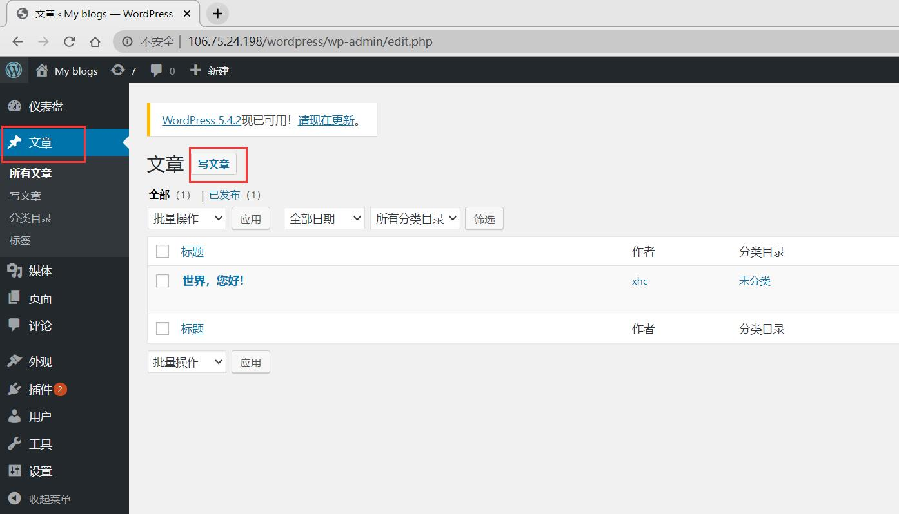
3. 文章编辑完成后，点击页面右上角的发布按钮，即可发布文章
   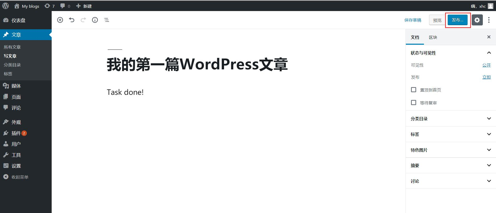
4. 发布成功的文章可以在文章管理页面中看到
   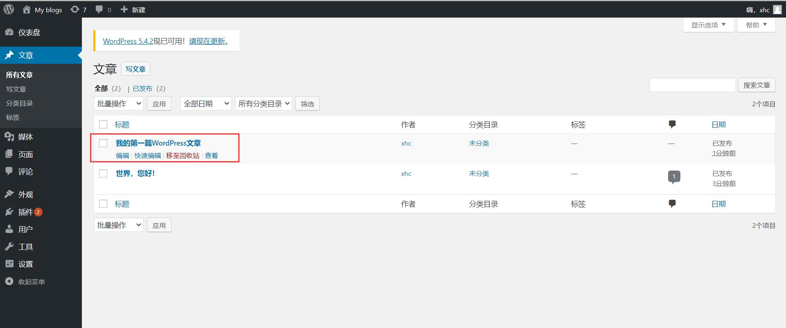

## 为UHost主机制作镜像
1. 首先将UHost主机关闭，在主机管理页面将横向滚动条拉至最右,在更多按钮中选择关闭
   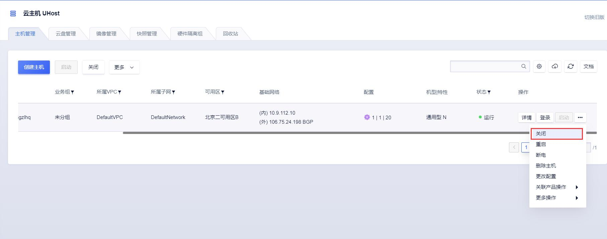
   等待主机关闭成功出现以下提示
   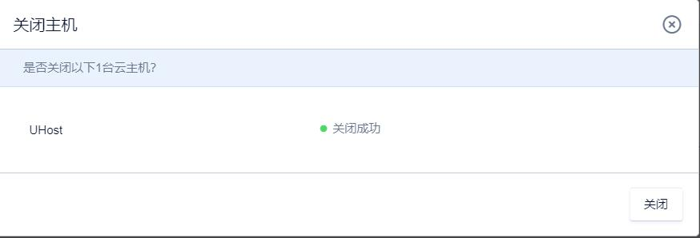
2. 主机关闭后，在更多按钮中选择 更多操作-制作镜像
   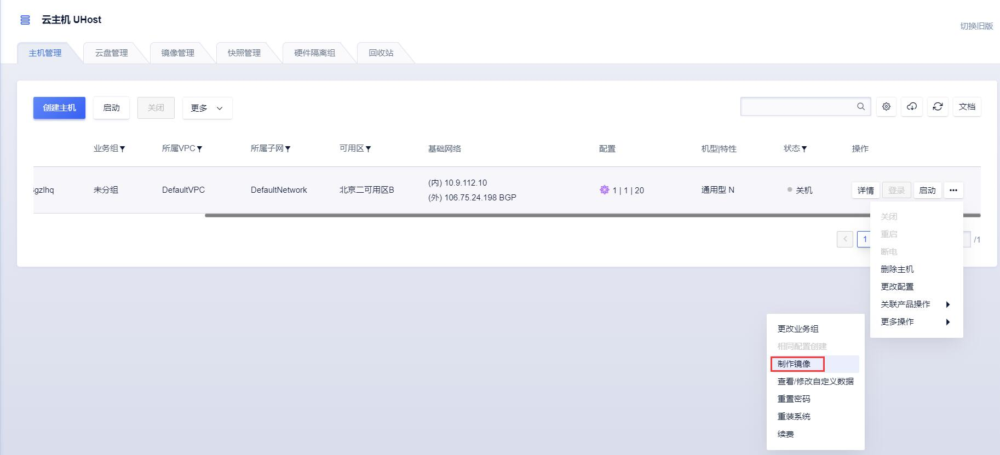
3. 填入镜像的描述信息，点击确定
   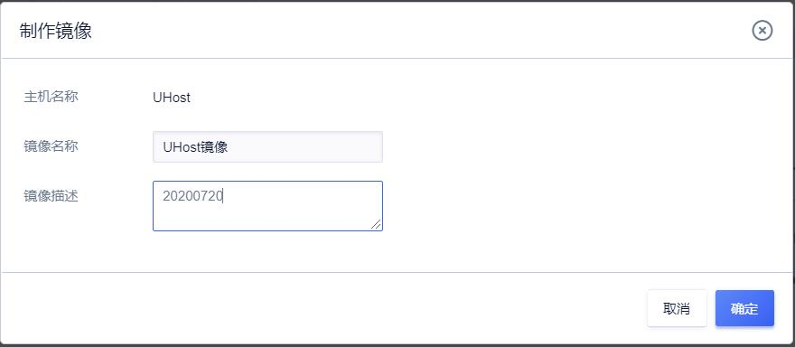
   之后，镜像就开始制作了